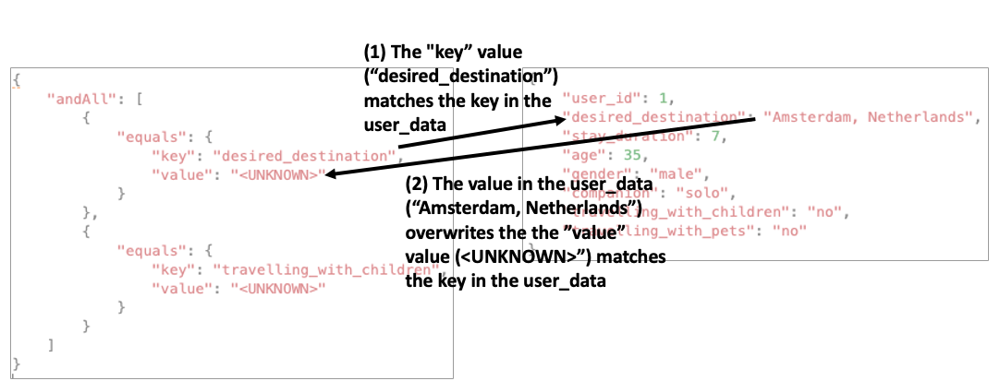

Copyright Amazon.com, Inc. or its affiliates. All Rights Reserved.
SPDX-License-Identifier: MIT-0

# Getting started

All of the code is in the code.ipynb notebook. You will need an AWS account to run the notebook. Further details are provided in the notebook itself.
All the data needed to run the code is provided in this repository.

# Introduction

[Knowledge Bases for Amazon Bedrock](https://aws.amazon.com/bedrock/knowledge-bases/) offers a fully managed Retrieval-Augmented Generation (RAG) feature that connects large language models (LLMs) to internal data sources. It is a cost-effective approach to improving LLM output so it remains relevant, accurate, and useful in various contexts. It also provides developers with greater control over the LLM’s outputs, including the ability to include citations and manage sensitive information.

Knowledge Bases has a metadata filtering capability which allows users to refine search results based on specific attributes of the documents, improving retrieval accuracy and the relevance of responses. These metadata filters can be used in combination with the typical semantic (or hybrid) similarity search. Improving document retrieval results helps personalize the responses generated for each user. Dynamic metadata filters allows you to instantly create custom queries based on the varying user profiles or user inputted responses so documents retrieved will only contain information relevant to the user’s needs.

# Solution overview

In this post you will exclusively focus on the retrieval portion of RAG; the upstream components including document ingestion and query formatting are prerequisites, and are provided as static data instead of code. The downstream generation component is out of scope. You should know basic retrieval techniques such as similarity search.

You will use an example of a travel website where the user answers a few questions about their travel preferences (including desired destination, preferred activities, and traveling companions) and then the system retrieves relevant documents.

# Dynamic metadata filtering

## Prerequisite: create Knowledge Base with documents and metadata

You will need a Bedrock Knowledge Base populated with documents and metadata. If you are not sure how to create that please reference this [documentation](https://docs.aws.amazon.com/bedrock/latest/userguide/knowledge-base-create.html). There are also have example documents and metadata [PUBLIC LINK?] in the notebook for you to upload in the console.

The associated notebook contains the required library imports and environment variables. Ensure you run the notebook using an IAM role with the correct permissions. 

## Dynamic filter

The "value" field within the filter need to be updated at request time. This means overwriting the retrieval_config object. 

Since the retrieval_config is a nested hierarchy of logical conditions, i.e. a tree, you can implement breadth first search to identify and replace all  the "value" field values (where "value" is the key and "<UNKNOWN>" is the placeholder value) with the corresponding value from the user data. This is implemented in the setup_retrieval_config and replace_values functions.

### Option 1: create retriever each time

To define the retrieval_config parameter dynamically, you can instantiate the AmazonKnowledgeBasesRetriever each time. This easily integrates into a larger LangChain centric codebase.

### Option 2: access underlying Boto3 API

The Boto3 API is able to directly retrieve with a dynamic retrieval_config. You can take advantage of this by accessing the object that AmazonKnowledgeBasesRetriever wraps. This is sightly faster but is less pythonic because it relies on LangChain implementation details which may change without notice. However this requires additional code to adapt the output to the proper format for a LangChain Retriever.

## Result

Begin by reading in the user data. This example data contains user answers to an online questionnaire about travel preferences. The user_data fields must match the metadata fields.

Test the code with filters turned on and off. Only use a few filtering criteria because restrictive filters might return zero documents,

Finally you will run both retrieval chains through both sets of filters for each user.

Analyzing the results, you will see that the first half of the documents are identical to the second half. In addition when metadata filters are not used the documents retrieved are occasionally for the wrong location. For example Trip ID 9 is to Barcelona but retriever pulls documents about Lisbon.

## Cleanup

To avoid incurring additional charges be sure to delete your [Bedrock Knowledge Base](https://docs.aws.amazon.com/bedrock/latest/userguide/knowledge-base-manage.html#kb-delete) and underlying [S3 bucket](https://docs.aws.amazon.com/AmazonS3/latest/userguide/delete-bucket.html).

# Conclusion

Dynamic metadata filtering in Knowledge Bases for Amazon Bedrock enhances document retrieval in RAG systems by tailoring outputs to user-specific needs, significantly improving the relevance and accuracy of LLM-generated responses. In a travel website example, filters ensured that retrieved documents closely matched user preferences. This approach can be applied to various other use cases, such as customer support, personalized recommendations, and content curation, where context-sensitive information retrieval is essential. Properly configured filters are crucial for maintaining accuracy across different applications, making this feature a powerful tool for refining LLM outputs in diverse scenarios.
